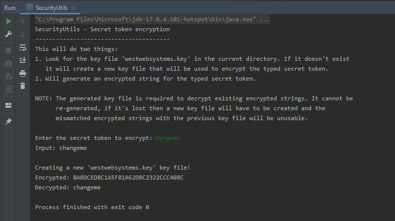

# Spring-Boot-MariaDB-Pass-Encrypt
A Spring Boot sample connecting to a MariaDB database and using encryption to hide the password.

A security key file is used to store encryption keys that are necessary for encrypting and decrypting data. 
Without this key file, encrypted data cannot be decrypted.

For this sample application to run you first need to generate your key file. Also you need to save the encrypted value for the database password.
This is done in one go when you run the class SecurityUtils through it's main entry point:

To generate a key file and to encrypt a password just run the main function of the SecurityUtils class.

Place the key file at the root of your project (same level as the pom file).
